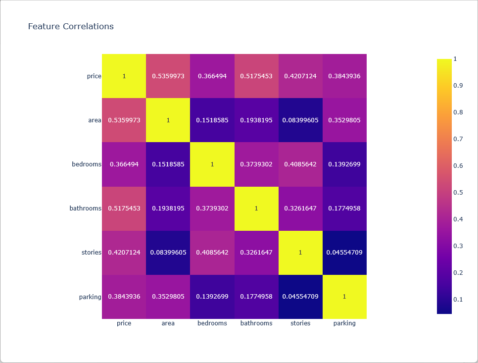
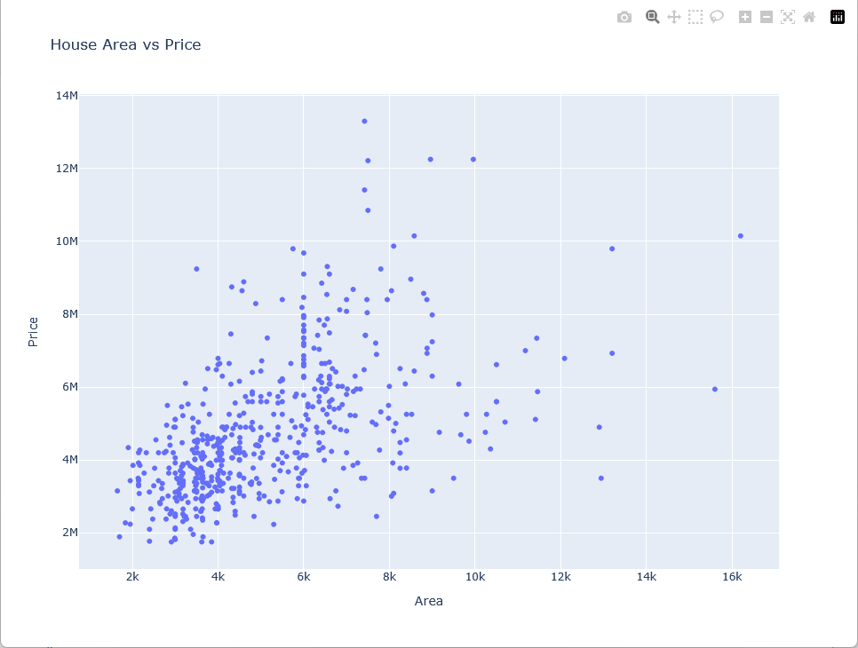
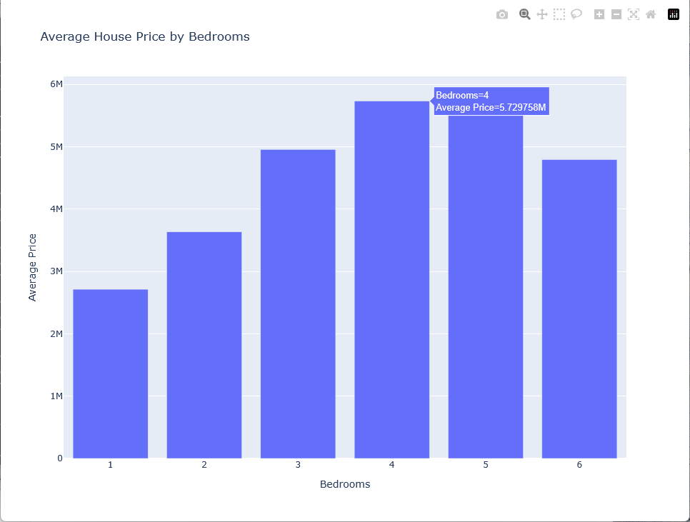

## House Price Analysis with PySpark

A PySpark data analysis project demonstrating:

• Reading Parquet datasets
• Data cleaning
• Feature engineering
• Exploratory Data Analysis
• Plotly visualizations

## Screenshots

## Technologies

- Python
- PySpark
- Plotly
- Pandas
- Parquet

## Project structure

src/
    loader.py
    cleaner.py
    analyzer.py
    visualizer.py

data/
    raw/
    processed/

## Example analyses

- Average house price
- Price by bedrooms
- Price by furnishing
- Price by parking
- Feature correlations
- Scatter plots
- Correlation heatmaps
- 